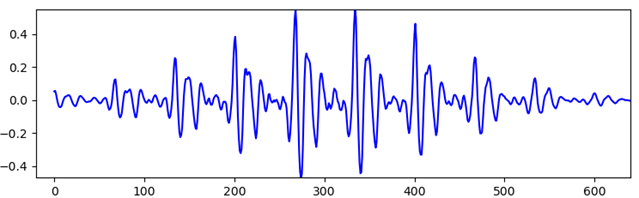
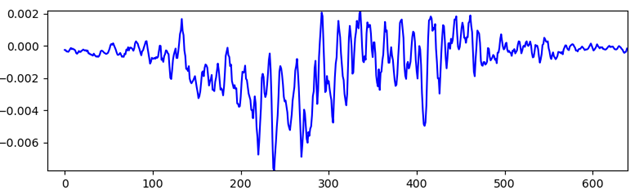
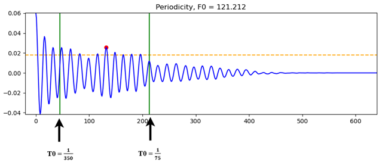
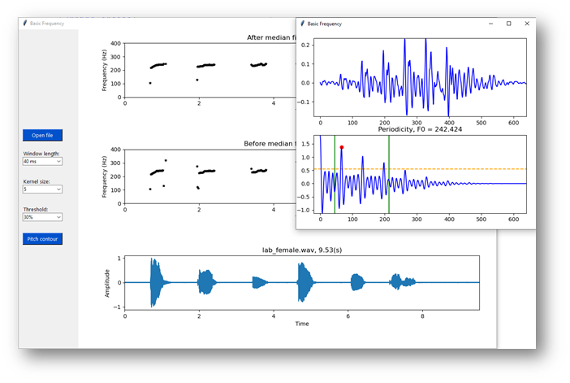

# WRITEN BY chau truong long

* Email 1: truonglongchau@gmail.com
* Email 2: 102180171@sv.dut.edu.vn
  
## Tools and language

* Tools: pycharm
* Python 3: tkinter, matplotlib, numpy, scipy

## Fundamental frequency(F0) on time domain using auto correlation function

> ### A periodicity window of a signal

> ### A non periodicity window of a signal

> ### A window contains F0

> ### Main Gui

