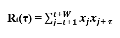
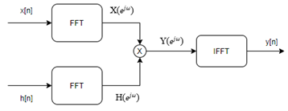
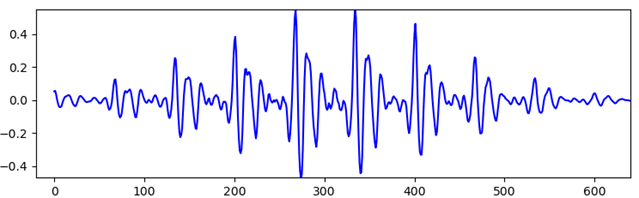
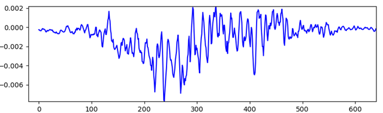
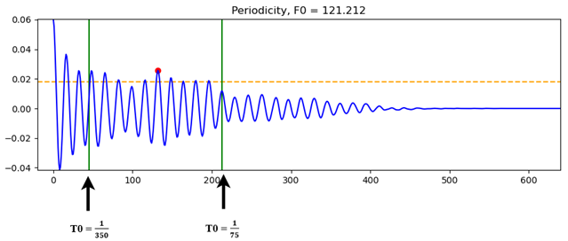
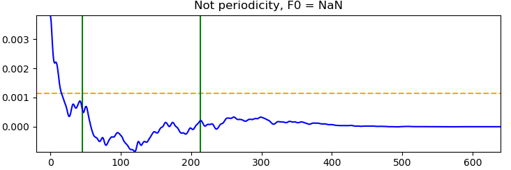
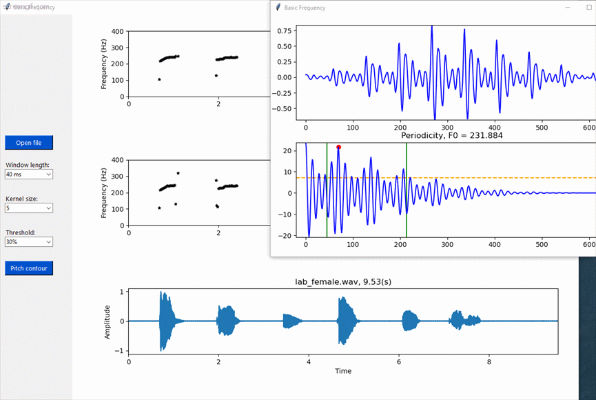

# Fundamental Frequency

Desktop application for estimating the fundamental frequency (`F0`) of a speech waveform in the time domain with an autocorrelation-based approach.

> Written by Chau Truong Long

- Email: truonglongchau@gmail.com

## Overview

This project loads a `.wav` file, splits it into overlapping analysis windows, computes an autocorrelation curve for each window, and estimates the fundamental frequency when a valid periodic structure is detected.

The UI shows:

- `After median filter`: the smoothed pitch contour
- `Before median filter`: the raw pitch contour
- `Wave file`: the waveform used for analysis
- `Window Details`: a hover preview panel that shows the local waveform window and its autocorrelation response

## Features

- Time-domain `F0` estimation based on autocorrelation
- FFT-based autocorrelation implementation for better performance
- Adjustable:
  - window length
  - median filter kernel size
  - autocorrelation threshold
- Interactive waveform hover preview for local window inspection
- Tkinter desktop UI with Matplotlib plots

## Project Structure

The codebase has been refactored into small modules so the application is easier to understand and maintain.

```text
.
├── app
│   ├── analysis
│   │   └── pitch.py
│   ├── services
│   │   ├── audio_loader.py
│   │   ├── pitch_service.py
│   │   ├── results.py
│   │   └── worker_runner.py
│   ├── ui
│   │   ├── main_window.py
│   │   └── preview_panel.py
│   ├── config.py
│   ├── controller.py
│   ├── preview_controller.py
│   └── state.py
├── audio
├── image
├── screenshots
├── tests
└── main.py
```

### Module Guide

- `main.py`
  - Thin application entrypoint kept at the repository root for easy startup.
- `app/controller.py`
  - Main application coordinator.
  - Wires the window, services, worker runner, and shared state together.
- `app/preview_controller.py`
  - Handles hover-panel lifecycle, delayed preview rendering, and drag behavior.
- `app/config.py`
  - Centralized UI strings, theme values, layout constants, and analysis defaults.
- `app/state.py`
  - Shared state models for audio data, worker state, analysis settings, and hover state.
- `app/analysis/pitch.py`
  - Signal-processing functions for autocorrelation, peak detection, median filtering, and pitch contour extraction.
- `app/services/audio_loader.py`
  - Loads and normalizes wave files.
- `app/services/pitch_service.py`
  - Builds pitch computations and preview-window analysis data.
- `app/services/results.py`
  - Typed service result models used between background work and the UI thread.
- `app/services/worker_runner.py`
  - Small helper that manages the single background worker thread.
- `app/ui/main_window.py`
  - Builds the Tk window, sidebar controls, main graphs, and loader UI.
- `app/ui/preview_panel.py`
  - Floating in-app preview panel used by waveform hover inspection.
- `tests/test_pitch_analysis.py`
  - Lightweight unit tests for analysis and service behavior.

## Requirements

- Python 3
- `tkinter`
- `matplotlib`
- `numpy`
- `scipy`

## How To Run

Run the application from the project root:

```bash
python main.py
```

If you use a virtual environment:

```bash
source .venv/bin/activate
python main.py
```

## How To Run Tests

If you use the project virtual environment:

```bash
.venv/bin/python -m unittest discover -s tests -p "test_*.py"
```

## How To Use

1. Click `Open file`.
2. Select a `.wav` file.
3. Choose:
   - `Window length`
   - `Kernel size`
   - `Threshold`
4. Click `Pitch contour`.
5. Move the mouse over the waveform plot to inspect local windows in the `Window Details` panel.

## Analysis Notes

### Windowing

The waveform is processed in overlapping windows. A Hamming window is applied before autocorrelation to reduce edge discontinuities.

### Autocorrelation

The application uses an FFT-based autocorrelation method in normal operation because it is significantly faster than the direct `O(n^2)` implementation.

### Peak Validation

A window is accepted as periodic only when:

- a valid local maximum exists in the expected delay range
- the peak is above the configured threshold
- the peak-to-valley difference is strong enough
- the resulting `F0` falls inside the supported speech range

### Median Filtering

The raw pitch contour is post-processed with a median filter to reduce isolated pitch outliers.

## Screenshots And Demos

### Autocorrelation

#### Original implementation (`O(n^2)`)

<p align="center">
    
</p>

#### FFT-based implementation (`O(n log n)`)

<p align="center">
    
</p>

### A periodicity window of a signal

<p align="center">
    
</p>

### A non-periodicity window of a signal

<p align="center">
    
</p>

### A window containing `F0`

<p align="center">
    
</p>

### A window without `F0`

<p align="center">
    
</p>

### Main GUI demo

<p align="center">
    
</p>

## Refactor Notes

This project originally lived in a single large script. It has been refactored to:

- separate signal-processing logic from UI code
- centralize configuration and UI copy
- reduce duplicated logic
- make hover, loader, and worker behavior easier to follow
- keep `main.py` simple and readable
