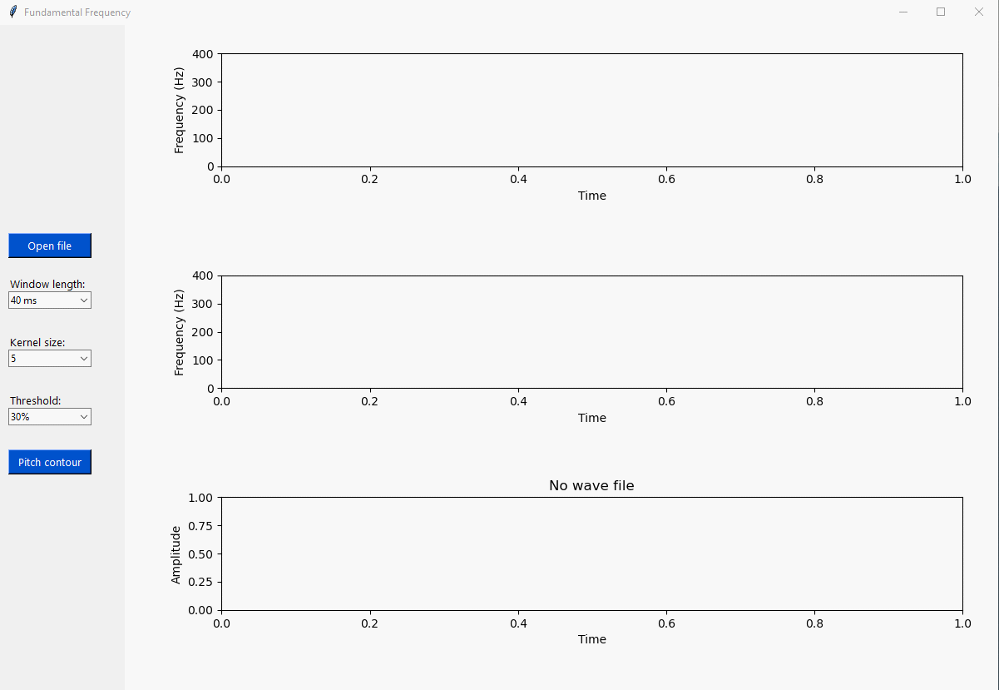

# WRITEN BY chau truong long

* Email 1: truonglongchau@gmail.com
* Email 2: 102180171@sv.dut.edu.vn
  
## Tools and language

* Tools: pycharm
* Python 3: tkinter, matplotlib, numpy, scipy

## To run code
Run:
```shell 
python main.py 
```

## Fundamental frequency(F0) on time domain using auto correlation function

> ### A periodicity window of a signal
<p align="center"></p>


> ### A non periodicity window of a signal


> ### A window contains F0


> ### A window not contains F0


> ### Main Gui


